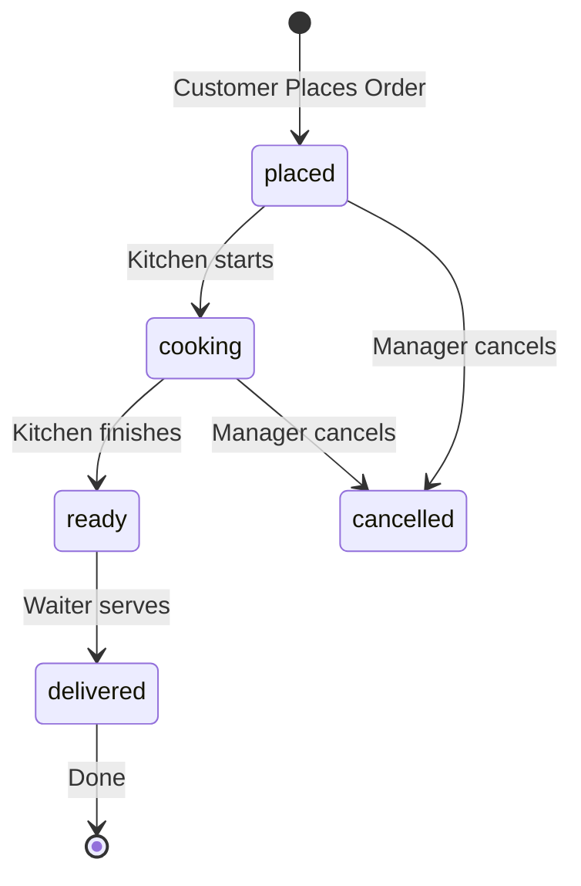

# Order Flow Documentation

## Overview

The Indo Cafe ordering system is designed around a **Universal Order Interface** where the "Home Page" adapts to the user's context:

1.  **Dine-In (QR Code)**: Primary flow. User is at a physical table.
2.  **Delivery/Takeaway**: User is remote (Future Phase).

---

## 🔄 The Dine-In Lifecycle (Core)

This lifecycle links the Customer, Manager, Waiter, and Kitchen into a single synchronized flow.

### 1. The Setup (Reservation/Allocation)

- **Who**: Manager or Waiter.
- **Action**: A Customer walks in. The staff assigns them `Table 5`.
- **System State**: `Table 5` is marked **Occupied/Reserved**.

### 2. Connection (QR Scan)

- **Who**: Customer.
- **Action**: Scans QR code on table.
- **URL**: `https://app.indocafe.com/:outletId/:tableId`
- **System State**: Frontend detects `tableId`. LocalStorage sets "Dine-In Mode".

### 3. Ordering (The Session)

- **Who**: Customer (or Waiter on behalf of customer).
- **Action**: Browse Menu -> Add to Cart -> **Place Order**.
- **API Payload**:
  ```json
  {
    "outletId": "...",
    "tableId": "table_123",
    "items": [...],
    "status": "placed"
  }
  ```
- **Note**: Multiple orders can be placed in one session (e.g., Starters first, then Mains).

### 4. Kitchen Processing

- **Dashboard**: `KitchenDashboard`
- **View**: Sees "Table 5 - Order #1".
- **Actions**:
  1.  **Start Cooking**: Changes status `placed` -> `cooking`.
  2.  **Mark Ready**: Changes status `cooking` -> `ready`.

### 5. Service

- **Who**: Waiter.
- **Dashboard**: `WaiterDashboard` (Active Orders).
- **View**: Sees "Table 5 - Ready".
- **Action**: Delivers food -> Clicks **"Mark Served"**.
- **Status**: `ready` -> `delivered`.

### 6. Payment & Closure

- **Who**: Customer & Manager.
- **Action**: Customer requests bill. Payments are processed.
- **Closure**: Manager clicks **"Release Table"**.
- **System State**: Table 5 is now **Free**. API deletes/archives active session data for that table.

---

## 🛠️ Technical Implementation

### Order Status State Machine



### Data Model (Order)

key fields:

- `tableId` (ObjectId, ref: Table) - Critical for grouping orders by table.
- `status` (Enum) - `['placed', 'cooking', 'ready', 'delivered', 'cancelled']`.
- `outletId` (ObjectId) - Multi-tenancy support.

### Dashboards & Roles

| Role         | Dashboard View                       | Key Actions                                          |
| :----------- | :----------------------------------- | :--------------------------------------------------- |
| **Customer** | Mobile Menu (`/home`)                | Place Order, View Status.                            |
| **Manager**  | Live Orders (`/manager/live-orders`) | Override statuses, assign tables, cancel orders.     |
| **Kitchen**  | KDS (`/kitchen`)                     | View Ticket, Start Timer, Mark Ready.                |
| **Waiter**   | Waiter View (`/waiter`)              | Table Map, Serve Ready Orders, "Call Waiter" alerts. |

---

## 🚀 Improvements & Next Steps

1.  **Session Grouping**: Ensure the backend groups multiple orders from the same table under one "Bill" for easy checkout.
2.  **Payment trigger**: Releasing a table should ideally require a "Payment Confirmed" check.
3.  **Notifications**: Websocket events should trigger toast notifications ("New Order!" for Kitchen, "Food Ready!" for Waiter).
